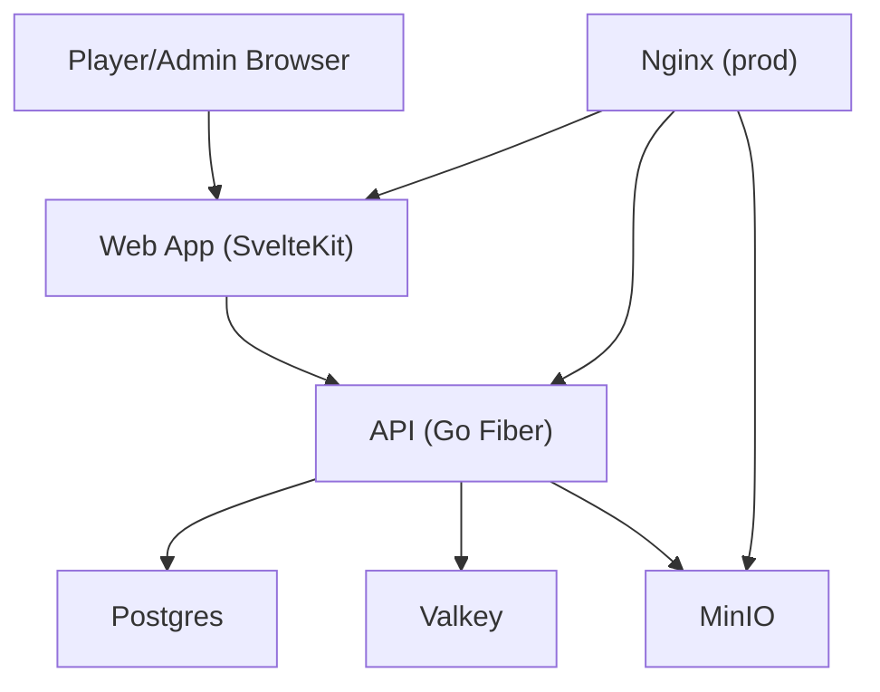
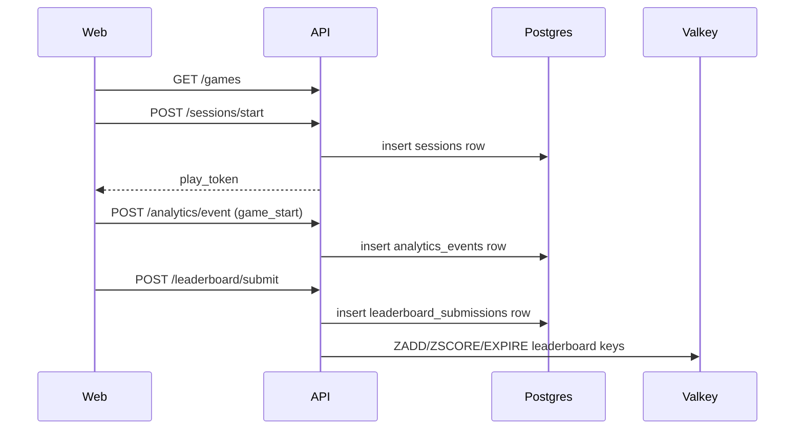

# MVP Architecture

## System Components
- **Web (SvelteKit)**: Player catalog/play UI and Admin UI (`apps/web`)
- **API (Go Fiber)**: Public + Admin HTTP API (`services/api`)
- **Postgres**: Source of truth for games, sessions, analytics, submissions, moderation state
- **Valkey (Redis-compatible)**: Leaderboard sorted-set index/cache + rate-limit counters
- **MinIO**: HTML5 game package/object storage
- **Nginx (prod)**: Reverse proxy for `/api/*`, static web serving, game asset path routing

## Core Domains
- **Games**: Catalog, game detail, metadata, active/draft lifecycle
- **Sessions**: Start play session, issue short-lived play token
- **Analytics**: Event ingestion (`game_start`, etc.) into Postgres
- **Leaderboards**: Score submit/read, daily/weekly scopes, game/global keys
- **Moderation**: Flagged submissions list + remove score workflow
- **Admin**: Auth, dashboard overview, moderation operations

## High-Level Diagram

## Key Flows

### 1) Play Flow

### 2) Score Submit
- Game sends `POST /leaderboard/submit` with play token + guest header
- API validates token + game match
- Anti-cheat/rate checks run (score bounds, burst detection, rate limit)
- Submission stored in Postgres (`leaderboard_submissions`)
- Best score upserted to Valkey sorted sets (daily/weekly)

### 3) Moderation
- Admin calls `GET /admin/moderation/flagged-submissions`
- Admin calls `POST /admin/moderation/remove-score` with `submission_id`
- API updates Postgres (`flagged`, `flag_reason`, `removed_by_admin_id`, `removed_at`)
- API executes Valkey `ZREM` for related leaderboard keys

### 4) Popularity
- Game events written to `analytics_events` (`event_name='game_start'`)
- Public catalog `sort=popular` query ranks active games by 7-day `game_start` count

## Data Stores
- **Postgres (source of truth)**
  - Core tables: `games`, `sessions`, `analytics_events`, `leaderboard_submissions`, `users`
  - Durable moderation and analytics history
- **Valkey (cache/index)**
  - Leaderboard keys (`lb:game:*`, `lb:global:*`) for fast top-N reads
  - Rate-limit / anti-burst counters (`rl:*`, `ac:*`)

## Bootstrap Model
- **Baseline migration**: `db/migrations/000_baseline.sql` creates full MVP schema in one pass
- **Single seed**: `db/seeds/seed.sql` loads minimal MVP-ready data (admin, categories, active games)
- **Operational model**: fresh DB bootstrap uses baseline + seed; no legacy migration chain required

## Trust Boundaries
- **Public endpoints** (`/api/games`, `/api/sessions/start`, `/api/analytics/event`, `/api/leaderboard/*`)
  - Session token required for score submit; play token validation enforced
  - Leaderboard submit rate limiting enforced
- **Admin endpoints** (`/api/admin/*`)
  - JWT bearer token required
  - Role check must be `admin`
- **Token validation**
  - Play tokens and admin JWTs validated at API boundary
- **Rate limiting**
  - Leaderboard submit: Valkey-backed request throttling
  - Analytics event ingestion: in-memory per-session limiter
